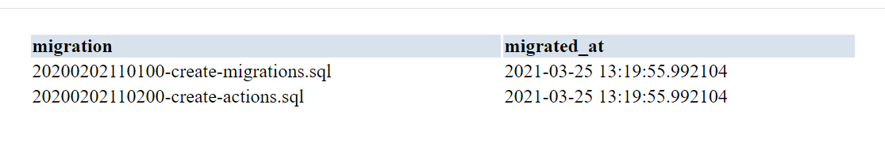

# Lab 08

## Exercise 1: Configure PHPAPP


## Exercise 2: Create a client table:

```sql
CREATE TABLE clients (
  name VARCHAR(100), 
  token VARCHAR(100) UNIQUE,
  data JSONB)
); 
```
## Exercise 3: Create API

PHP api
```php
<?php
$reply = ["hello" => "world"];
header("Content-Type: application/json");
foreach (getallheaders() as $name => $value){
	echo "$name: $value\n";
}
echo json_encode($reply);
```

Testing our server: <br/>


