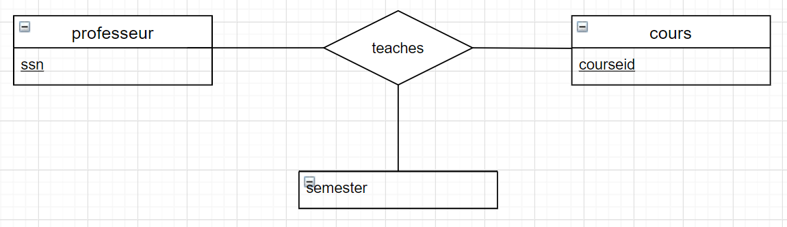

Name: Ishanveer Sharma Gobin

Student No: 300135454

Lab 03

Tous les dessins ont ete fait en utilisant draw.io

# Une base de données universitaire

Une base de données universitaire contient des informations sur les professeurs (identifié par le numéro de sécurité sociale ou SSN) et les cours (identifié par courseid). Les professeurs donnent des cours; chacun de les situations suivantes concernent l'ensemble de relation `teaches`.

1. Les professeurs peuvent enseigner le même cours sur plusieurs semestres et seule la plus récente doit être enregistrée.

2. Chaque professeur doit enseigner un cours.

3. Chaque professeur enseigne exactement un cours (ni plus, ni moins).

4. Chaque professeur enseigne exactement un cours (ni plus, ni moins), et chaque cours doit être enseigné par un professeur.

5. Les professeurs peuvent enseigner le même cours sur plusieurs semestres et chaque doit être enregistrée.

6. Supposons maintenant que certains cours puissent être enseignés conjointement par une équipe de professeurs, mais il est possible qu'aucun professeur dans une équipe ne puisse enseigner le cours. Modélisez cette situation en introduisant des ensembles d'entités et des ensembles de relations supplémentaires si nécessaire.

