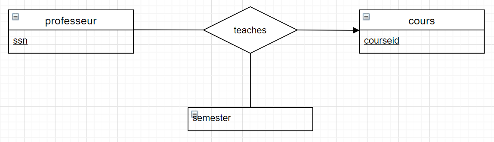
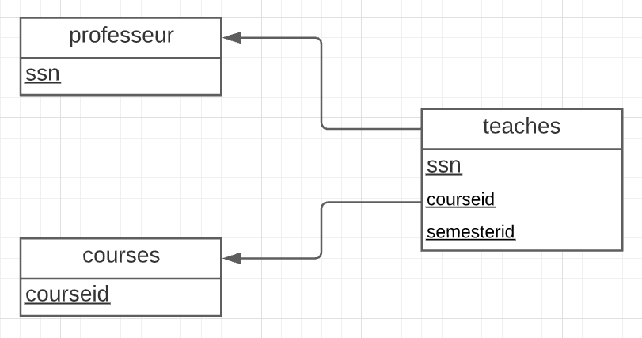
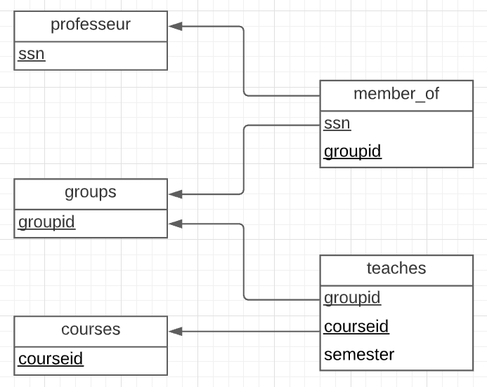

Name: Ishanveer Sharma Gobin

Student No: 300135454

Lab 04

1. Les professeurs peuvent enseigner le même cours sur plusieurs semestres et seule la plus récente doit être enregistrée.


```sql
CREATE TABLE professors(
 ssn integer, 
primary key (ssn)
);

CREATE TABLE courses(
 courseid varchar(100), 
primary key (courseid)
);

CREATE TABLE teaches(
 ssn integer,
 courseid varchar(100),
 semesterid varchar(100), 
primary key (ssn, courseid),
 foreign key (ssn) references professors,
 foreign key (courseid) references courses
);
```

3. Chaque professeur enseigne exactement un cours (ni plus, ni moins).



```sql
CREATE TABLE professors(
    ssn integer, 
    primary key (ssn)
);

CREATE TABLE courses(
    courseid varchar(100), 
    primary key (courseid)
);

CREATE TABLE teaches(
    ssn integer,
    courseid varchar(100),
    semesterid varchar(100), 
    primary key (ssn),
    foreign key (ssn) references professors
);
```

5. Les professeurs peuvent enseigner le même cours sur plusieurs semestres et chaque doit être enregistrée.



```sql
CREATE TABLE professors(
    ssn integer, 
    primary key (ssn)
);

CREATE TABLE courses(
    courseid varchar(100), 
    primary key (courseid)
);

CREATE TABLE teaches(
    ssn integer,
    courseid varchar(100),
    semesterid varchar(100), 
    primary key (ssn, courseid, semesterid),
    foreign key (ssn) references professors,
    foreign key (courseid) references courses
);
```

6. Supposons maintenant que certains courspuissent être enseignés conjointement parune équipe de professeurs, mais il estpossible qu'aucun professeur dans un eéquipe ne puisse enseigner le cours. Modélisez cette situation en introduisant des ensembles d'entités et des ensembles de relations supplémentaires si nécessaire.



```sql
CREATE TABLE professors(
    ssn integer, 
    primary key (ssn)
);

CREATE TABLE courses(
    courseid varchar(100), 
    primary key (courseid)
);

CREATE TABLE groups(
    groupid varchar(100),
    primary key (groupid)
);

CREATE TABLE member_of(
    ssn integer, 
    groupid varchar(100),
    primary key (ssn, groupid),
    foreign key (ssn) references professors,
    foreign key (groupid) references groups
);


CREATE TABLE teaches(
    groupid varchar(100),
    courseid varchar(100),
    semesterid varchar(100), 
    primary key (groupid, courseid, semesterid),
    foreign key (groupid) references groups,
    foreign key (courseid) references courses
);
```
